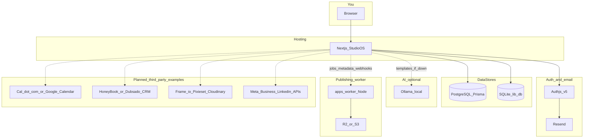
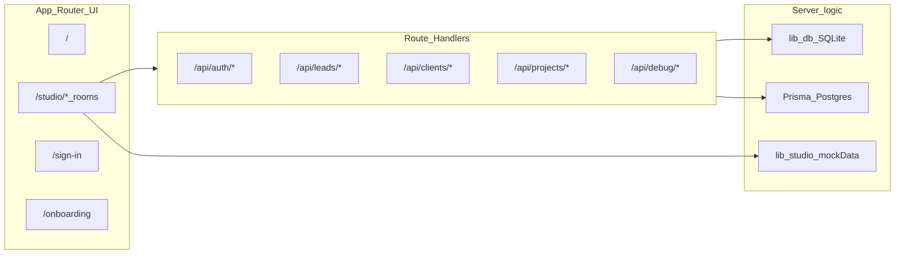
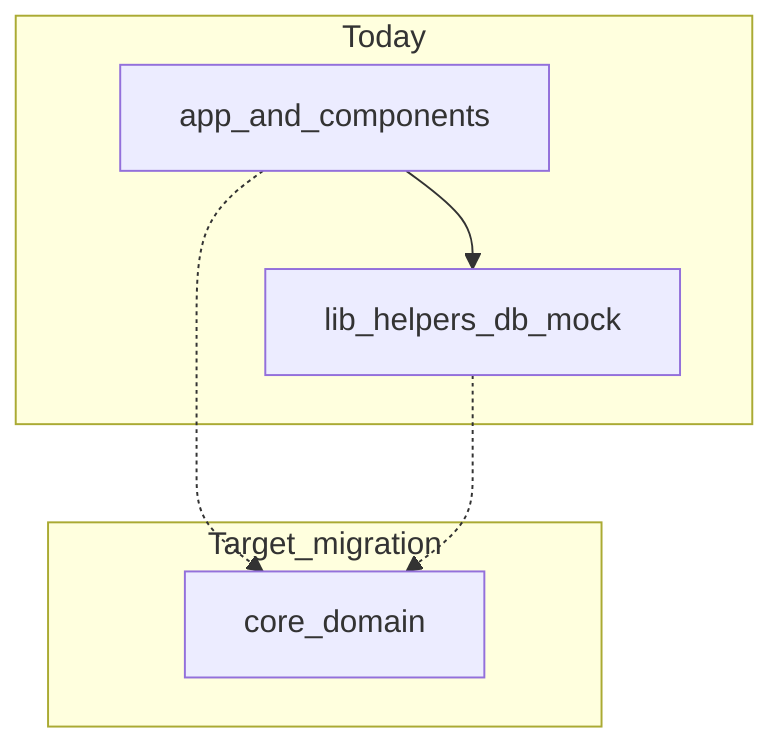

# Studio OS mission control — full project diagram

Versioned reference for **studio-os-standalone**: what exists today, how it connects, and what you wire next. For agent/room narratives, see [readme_diagrams.md](./readme_diagrams.md). For high-level goals, see [system_design.md](./system_design.md).

## What you are building

**studio-os-standalone** is a **Next.js 15 App Router** app (**Bright Line Studio OS**): a studio mission control with room-based navigation under `/studio` (dashboard, CRM, projects, production, publishing, finance, settings). This repo is **standalone** (no other Brightline app code in-tree).

## Diagram 1 — System context

You, the hosted app, data stores, auth, optional AI, the publishing worker, and **example** third-party systems you may connect later (not exhaustive).

**Solid lines** — implemented or first-class in this repo and deployment docs today.

**Dotted lines** — optional today (see `.env.example`, `apps/worker`) or roadmap-shaped (calendar, studio CRM, galleries/DAM, approved social publish). Product rules in `docs/02-architecture/readme_diagrams.md` still treat many publish actions as gated.

## Example vendors by integration type

Replace or extend these when you pick real vendors; they are **examples**, not commitments.

| Type | Example products | Typical integration style |
|------|------------------|---------------------------|
| Scheduling / calendar | [Cal.com](https://cal.com), Google Calendar API, Calendly | OAuth, webhooks, embed |
| Studio CRM / contracts | HoneyBook, Dubsado, Studio Ninja | OAuth, Zapier, CSV export |
| Client galleries / DAM | Pixieset, Cloudinary, Frame.io, Dropbox | API keys, webhooks, shared links |
| Social (approved publish) | Meta Business Suite, LinkedIn Marketing API | OAuth, scheduled posts via worker |

## Diagram 2 — Inside the Next.js app

Room tree matches the root `README.md` and `app/studio/` (dashboard, CRM leads/clients/inquiry/lounge, projects/jobs/archive, production editing/delivery/approvals, publishing, finance, settings/automation).

## Diagram 3 — Data split (two databases)

This split is **intentional** in the current codebase.

| Layer | Role |
|-------|------|
| **PostgreSQL + Prisma** | CRM and Projects APIs (`prisma/schema.prisma`, `app/api/leads`, `app/api/clients`, `app/api/projects`). Production needs a real `DATABASE_URL` (`DEPLOY.md`). |
| **SQLite via `lib/db`** | Legacy/local-first studio data (workspaces, sessions, events, drafts, etc.). Server-side only; `next.config.ts` lists `better-sqlite3` under `serverExternalPackages` for serverless. |

**Mission control ASAP:** ship the **visual UI** immediately; for **CRM/Projects APIs** on Vercel, provision Neon, Supabase, or similar Postgres and set environment variables per `DEPLOY.md`.

## Diagram 4 — Separate worker

`apps/README.md` and `apps/worker/`: a **Node worker** (Sharp + AWS S3-compatible client) for R2-style uploads. It is **not imported** by the main Next app. The link is operational: shared bucket credentials, CI, queues, or future webhooks—not a TypeScript import edge.

## Diagram 5 — Target architecture (`core/`)

Longer-term, domain logic should move from `lib/` into **`core/`** (`crm`, `projects`, `finance`, `media`, `automation`) while `app/` and `components/` stay thin. See `core/README.md`.

The agent / room / tool-registry story in `readme_diagrams.md` is the **product vision**; much of the Studio UI still uses **mock paths** until databases and services are wired (root `README.md`, “What’s next”).

## What to connect first

1. **Deploy:** Vercel + env from `DEPLOY.md` (`AUTH_SECRET`, `AUTH_URL`, Resend keys).
2. **Postgres:** `DATABASE_URL` for Prisma so CRM/Projects APIs are not “database not configured.”
3. **Optional:** Ollama locally for AI; R2 env vars + run `apps/worker` when you need the publishing pipeline.

When you lock in real vendors, update Diagram 1 and the **Example vendors** table above so the doc stays your source of truth.
